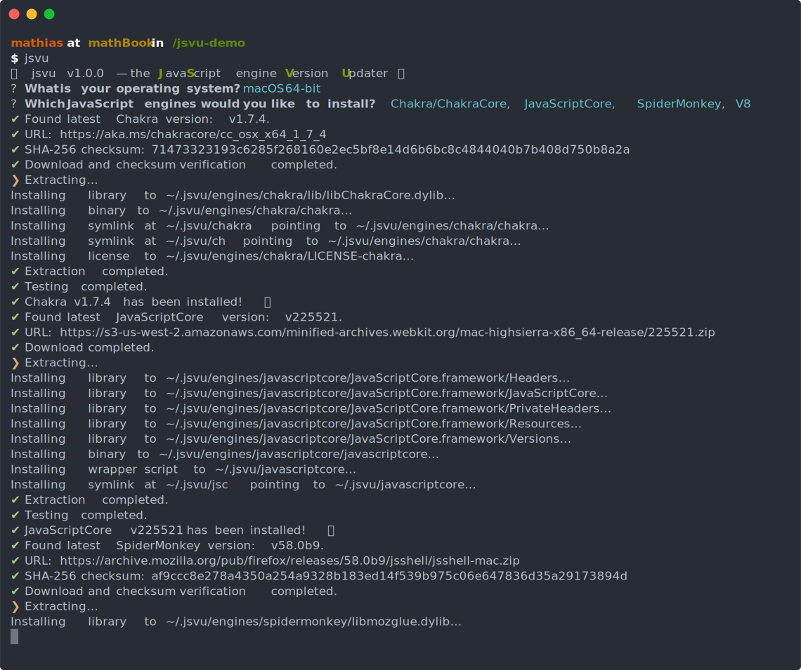

# jsvu [](https://github.com/GoogleChromeLabs/jsvu/actions/workflows/main.yml) [](https://www.npmjs.com/package/jsvu)

_jsvu_ is the <b>J</b>ava<b>S</b>cript (engine) <b>V</b>ersion <b>U</b>pdater.

_jsvu_ makes it easy to install recent versions of various JavaScript engines without having to compile them from source.

[](https://asciinema.org/a/rfS1M5ynKm1hGaBqJYJj0mGCi)

## Installation

**Note:** _jsvu_ requires Node.js v18+. (_jsvu_ follows the latest [active LTS](https://github.com/nodejs/Release#release-schedule) version of Node.)

Install the _jsvu_ CLI:

```sh
npm install jsvu -g
```

Modify your dotfiles (e.g. `~/.bashrc`) to add `~/.jsvu/bin` to your `PATH`:

```sh
export PATH="${HOME}/.jsvu/bin:${PATH}"
```

Then, run `jsvu`:

```sh
jsvu
```

On first run, `jsvu` prompts you for your operating system and architecture, and the list of JavaScript engines you wish to manage through `jsvu`. It then downloads and installs the latest version of each of the engines you selected.

To update the installed JavaScript engines later on, just run `jsvu` again.

## Supported engines per OS

| JavaScript engine         | Binary name               | `mac64` | `mac64arm` | `win32` | `win64`          | `linux32` | `linux64` |
| ------------------------- | ------------------------- | ------- | ---------- | ------- | ---------------- | --------- | --------- |
| [**Chakra**][ch]          | `chakra` or `ch`          | ✅      | ❌         | ✅      | ✅               | ❌        | ✅        |
| [**GraalJS**][graaljs]    | `graaljs`                 | ✅      | ❌         | ❌      | ✅               | ❌        | ✅        |
| [**Hermes**][hermes]      | `hermes` & `hermes-repl`  | ✅      | ❌         | ❌      | ✅               | ❌        | ✅        |
| [**JavaScriptCore**][jsc] | `javascriptcore` or `jsc` | ✅      | ✅         | ❌      | ✅ <sup>\*</sup> | ❌        | ✅        |
| [**QuickJS-ng**][quickjs] | `quickjs`                 | ✅      | ✅         | ✅      | ✅               | ✅        | ✅        |
| [**SpiderMonkey**][sm]    | `spidermonkey` or `sm`    | ✅      | ✅         | ✅      | ✅               | ✅        | ✅        |
| [**V8**][v8]              | `v8`                      | ✅      | ✅         | ✅      | ✅               | ✅        | ✅        |
| [**V8 debug**][v8]        | `v8-debug`                | ✅      | ✅         | ✅      | ✅               | ✅        | ✅        |
| [**XS**][xs]              | `xs`                      | ✅      | ✅         | ❌      | ✅               | ❌        | ✅        |

<sup>\*</sup> JavaScriptCore requires external dependencies to run on Windows:
- On 32-bit Windows, install [iTunes](https://www.apple.com/itunes/download/).
- On 64-bit Windows, download the latest [`WebKitRequirements`](https://github.com/WebKitForWindows/WebKitRequirements/releases) and add its `bin64` directory to your `PATH`.

[ch]: https://github.com/Microsoft/ChakraCore/issues/2278#issuecomment-277301120
[graaljs]: https://github.com/oracle/graaljs
[hermes]: https://github.com/facebook/hermes/issues/17
[jsc]: https://bugs.webkit.org/show_bug.cgi?id=179945
[quickjs]: https://github.com/GoogleChromeLabs/jsvu/issues/141
[sm]: https://bugzilla.mozilla.org/show_bug.cgi?id=1336514
[v8]: https://bugs.chromium.org/p/chromium/issues/detail?id=936383
[xs]: https://github.com/Moddable-OpenSource/moddable-xst

## Integration with `eshost-cli`

[`eshost-cli`](https://github.com/bterlson/eshost-cli) makes it easy to run and compare code in all JavaScript engines that `jsvu` installs.

First, install `eshost-cli`:

```sh
npm install -g eshost-cli
```

Then, either automatically configure `jsvu`-installed hosts:

```sh
eshost --configure-jsvu
```

…or tell `eshost-cli` where `jsvu` installs each JavaScript engine following the instructions below.

### Linux/Mac

```sh
eshost --add 'Chakra' ch ~/.jsvu/bin/chakra
eshost --add 'GraalJS' graaljs ~/.jsvu/bin/graaljs
eshost --add 'JavaScriptCore' jsc ~/.jsvu/bin/javascriptcore
eshost --add 'QuickJS' qjs ~/.jsvu/bin/quickjs
eshost --add 'SpiderMonkey' jsshell ~/.jsvu/bin/spidermonkey
eshost --add 'V8 --harmony' d8 ~/.jsvu/bin/v8 --args '--harmony'
eshost --add 'V8' d8 ~/.jsvu/bin/v8
eshost --add 'XS' xs ~/.jsvu/bin/xs
```

### Windows

```bat
eshost --add "Chakra" ch "%USERPROFILE%\.jsvu\bin\chakra.cmd"
eshost --add "GraalJS" graaljs "%USERPROFILE%\.jsvu\bin\graaljs.cmd"
eshost --add "JavaScriptCore" jsc "%USERPROFILE%\.jsvu\bin\javascriptcore.cmd"
eshost --add "SpiderMonkey" jsshell "%USERPROFILE%\.jsvu\bin\spidermonkey.cmd"
eshost --add "V8 --harmony" d8 "%USERPROFILE%\.jsvu\bin\v8.cmd" --args "--harmony"
eshost --add "V8" d8 "%USERPROFILE%\.jsvu\bin\v8.cmd"
eshost --add "XS" xs "%USERPROFILE%\.jsvu\bin\xs.cmd"
```

That’s it! You can now run code snippets in all those engines with a single command:

```sh
eshost -e 'new RegExp("\n").toString()' # https://crbug.com/v8/1982

eshost -e '(function maxCallStackSize() { try { return 1 + maxCallStackSize(); } catch (_) { return 1; }}())'

eshost -e 'Date.parse("1 Octopus 2018")'
```

## Integration with non-interactive environments

On your personal devices, the only command you’ll ever need is `jsvu` as described above. There are no command-line flags to remember. 👋🏻

However, there are use cases for running jsvu within non-interactive environments (e.g. as part of continuous integration), where it’s desirable to bypass the initial `jsvu` prompt asking to confirm your operating system, architecture, and the list of JavaScript engines to install. Here’s how to do that:

```sh
jsvu --os=linux64 --engines=all
# Equivalent to:
jsvu --os=linux64 --engines=chakra,graaljs,hermes,javascriptcore,quickjs,spidermonkey,v8,xs
```

If the operating system and architecture are not known in advance, the `--os=default` flag attempts to guess the correct value from the running environment. This might not be right for example if running a 32-bit Node.js process on a 64-bit machine.

Note that `--engines=all` does not install the `v8-debug` binaries.

## Installing specific versions

jsvu also supports installing specific versions alongside the main engine binaries (which it keeps up to date). Here’s an example:

```sh
jsvu v8@7.2.502
```

Binaries installed using this method are named `${BINARY}-${VERSION}`, so that the above example installs a binary named `v8-7.2.502`. This way, there’s never any conflict with the main `v8` binary, which jsvu can keep up to date.

This feature works for all the supported engines:

```sh
jsvu chakra@1.11.6
jsvu graaljs@20.2.0
jsvu hermes@0.6.0
jsvu javascriptcore@242640
jsvu quickjs@2019-08-18
jsvu spidermonkey@66.0b13
jsvu v8@7.2.502
jsvu v8-debug@7.1.302
jsvu xs@8.7.0
```

If you pass in an invalid version number, or if the JavaScript engine creators don’t provide a precompiled binary for that specific version, jsvu shows an error.

As a shorthand, for `v8` and `v8-debug` builds, jsvu can even figure out the last known good revision within a [milestone](https://v8.dev/docs/version-numbers). To install the latest available V8 v7.2.x for example, run:

```sh
jsvu v8@7.2
# jsvu figures out that this means v7.2.502, and then installs that version.
```

## Security considerations

_jsvu_ avoids the need for `sudo` privileges by installing everything in `~/.jsvu/bin` rather than, say, `/usr/bin`.

_jsvu_ downloads files over HTTPS, and only uses URLs that are controlled by the creators of the JavaScript engine or, in the case of JavaScriptCore on Linux, the port maintainers.

## For maintainers

### How to publish new releases

1. On the `main` branch, bump the version number in `package.json`:

    ```sh
    npm version patch -m 'Release v%s'
    ```

    Instead of `patch`, use `minor` or `major` [as needed](https://semver.org/).

    Note that this produces a Git commit + tag.

1. Push the release commit and tag:

    ```sh
    git push && git push --tags
    ```

    Our CI then automatically publishes the new release to npm.

## Author

[Mathias Bynens](https://mathiasbynens.be/) ([@mathias](https://twitter.com/mathias))
